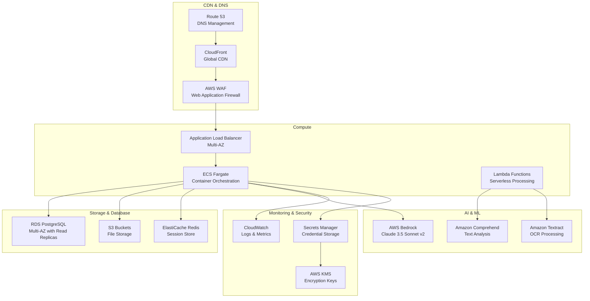

# ProcessMaster Pro - System Architecture

This document provides a comprehensive overview of the ProcessMaster Pro system architecture, including diagrams, data flows, and technical decisions.

## Table of Contents

1. [High-Level Architecture](#high-level-architecture)
2. [System Components](#system-components)
3. [Data Flow Diagrams](#data-flow-diagrams)
4. [Database Schema](#database-schema)
5. [API Architecture](#api-architecture)
6. [Frontend Architecture](#frontend-architecture)
7. [Security Architecture](#security-architecture)
8. [Deployment Architecture](#deployment-architecture)
9. [Integration Points](#integration-points)

## High-Level Architecture


## System Components

### Frontend Applications

#### Web Application (Next.js 14)


#### Chrome Extension
```mermaid
graph TD
    subgraph "Chrome Extension (Manifest V3)"
        SW[Service Worker<br/>Background Processing]
        CS[Content Scripts<br/>DOM Interaction]
        POPUP[Popup UI<br/>Extension Interface]
        OPTIONS[Options Page<br/>Settings]
    end
    
    subgraph "Capture System"
        SCREEN[Screen Capture API<br/>getDisplayMedia()]
        INTERACT[Interaction Tracking<br/>Mouse/Keyboard Events]
        UPLOAD[Upload Manager<br/>Direct S3 Upload]
    end
    
    SW --> CS
    SW --> POPUP
    SW --> OPTIONS
    CS --> SCREEN
    CS --> INTERACT
    SW --> UPLOAD
```

### Backend Services

#### API Server Architecture


## Data Flow Diagrams

### Screen Capture and Guide Generation Flow


### Authentication Flow


### File Upload and Processing Flow


## Database Schema

### Entity Relationship Diagram


### Key Database Tables

#### Core Tables
- **users**: User accounts and profiles
- **teams**: Team/organization management
- **guides**: Process documentation guides
- **capture_sessions**: Screen recording sessions

#### Content Tables
- **guide_steps**: Individual steps within guides
- **step_annotations**: Visual annotations on screenshots
- **capture_interactions**: User interactions during recording
- **capture_screenshots**: Screenshots taken during capture

#### System Tables
- **files**: File metadata and S3 references
- **ai_processing_jobs**: AI processing queue and status
- **audit_logs**: System audit trail
- **api_keys**: API access management

## API Architecture

### REST API Design

```mermaid
graph TD
    subgraph "API Endpoints"
        AUTH[/api/auth/*<br/>Authentication]
        USERS[/api/users/*<br/>User Management]
        TEAMS[/api/teams/*<br/>Team Operations]
        GUIDES[/api/guides/*<br/>Guide CRUD]
        CAPTURE[/api/capture/*<br/>Screen Capture]
        FILES[/api/files/*<br/>File Operations]
        AI[/api/ai/*<br/>AI Processing]
    end
    
    subgraph "Middleware Stack"
        CORS[CORS Handler]
        RATE[Rate Limiting]
        AUTH_MW[Authentication]
        VALID[Validation]
        ERROR[Error Handler]
    end
    
    subgraph "Controllers"
        AUTH_CTRL[AuthController]
        USER_CTRL[UserController]
        TEAM_CTRL[TeamController]
        GUIDE_CTRL[GuideController]
        CAPTURE_CTRL[CaptureController]
        FILE_CTRL[FileController]
        AI_CTRL[AIController]
    end
    
    AUTH --> AUTH_MW
    AUTH_MW --> VALID
    VALID --> AUTH_CTRL
    
    GUIDES --> AUTH_MW
    AUTH_MW --> VALID
    VALID --> GUIDE_CTRL
    
    CAPTURE --> AUTH_MW
    AUTH_MW --> VALID
    VALID --> CAPTURE_CTRL
```

### API Response Standards

```json
{
  "success": true,
  "data": {
    "id": "uuid",
    "title": "Guide Title",
    "steps": [...]
  },
  "metadata": {
    "total": 100,
    "page": 1,
    "limit": 20,
    "hasNext": true
  },
  "timing": {
    "requestId": "req_123",
    "duration": 150
  }
}
```

## Frontend Architecture

### Component Architecture


### State Management Strategy


## Security Architecture

### Authentication & Authorization Flow


### Data Protection Layers


## Deployment Architecture

### AWS Infrastructure



### Container Architecture


## Integration Points

### External Service Integrations


### Webhook and Event System


## Performance Considerations

### Caching Strategy


### Scaling Strategy


This architecture documentation provides a comprehensive view of the ProcessMaster Pro system, from high-level component interactions to detailed technical implementations. It serves as a reference for development, deployment, and maintenance activities.